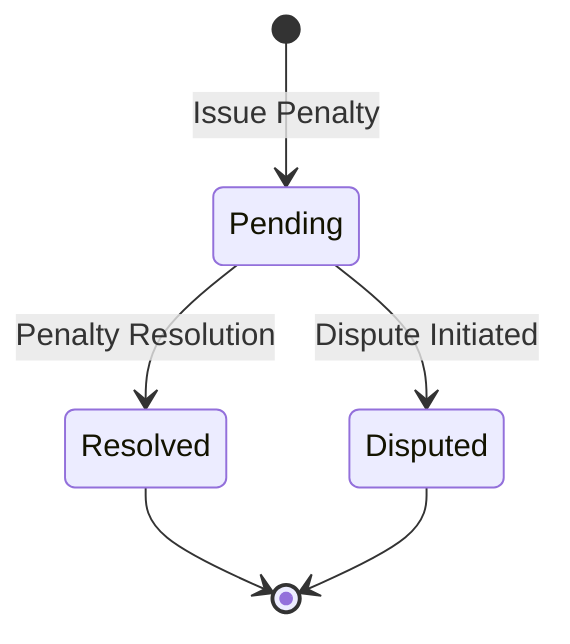

# Penalty Wrapper: Asset Compliance and Penalty Management

Penalty Wrapper is an advanced blockchain-native smart contract system designed to manage penalties, compliance, and dispute resolution for tokenized assets on the Stacks blockchain. It provides a robust mechanism for tracking, issuing, and resolving asset-related penalties while maintaining transparency and accountability.

## Overview

Penalty Wrapper enables precise tracking and management of asset penalties, offering:

- Penalty issuance for non-compliance
- Flexible penalty resolution mechanisms
- Dispute management
- Comprehensive penalty tracking and history

## Architecture

The contract manages asset penalties through a structured lifecycle:



### Core Components

1. **Penalty Registry**: Tracks all penalties and their current status
2. **Dispute Management**: Handles penalty disputes and resolutions
3. **Compliance Tracking**: Maintains detailed records of asset penalties
4. **Administrative Controls**: Enables contract owner oversight

## Contract Documentation

### Key Data Structures

- `asset-penalties`: Stores penalty details for specific assets
- `penalty-resolutions`: Records penalty resolution history
- Flexible tracking of penalty status (Pending, Resolved, Disputed)

### Access Control

- Contract Owner: Ultimate administrative authority
- Penalty Issuers: Can create new penalties
- Resolvers: Can resolve pending penalties
- Auditors: Can review penalty history

## Getting Started

### Prerequisites

- Clarinet
- Stacks wallet
- Understanding of asset compliance requirements

### Basic Usage

1. **Issue a Penalty**
```clarity
(contract-call? .penalty-wrapper issue-penalty
    "asset123"
    "penalty456"
    u10000
    "Compliance violation"
)
```

2. **Resolve a Penalty**
```clarity
(contract-call? .penalty-wrapper resolve-penalty
    "asset123"
    "penalty456"
    "full-payment"
    "Penalty resolved through payment"
)
```

3. **Dispute a Penalty**
```clarity
(contract-call? .penalty-wrapper dispute-penalty
    "asset123"
    "penalty456"
    "Incorrect penalty assessment"
)
```

## Function Reference

### Penalty Management

#### `issue-penalty`
```clarity
(issue-penalty asset-id penalty-id amount reason)
```
Issues a new penalty for a specific asset.

#### `resolve-penalty`
```clarity
(resolve-penalty asset-id penalty-id resolution-type details)
```
Resolves a pending penalty with specified resolution details.

#### `dispute-penalty`
```clarity
(dispute-penalty asset-id penalty-id dispute-reason)
```
Initiates a dispute for a specific penalty.

## Development

### Testing

Run the test suite using Clarinet:
```bash
clarinet test
```

### Local Development

1. Clone the repository
2. Install dependencies
3. Start Clarinet console:
```bash
clarinet console
```

## Security Considerations

### Penalty Issuance
- Penalties can only be created with valid asset references
- Prevents duplicate penalty creation
- Tracks detailed penalty metadata

### Penalty Resolution
- Multiple resolution pathways
- Comprehensive logging of resolution details
- Dispute mechanism for challenging penalties

### Access Control
- Strict administrative controls
- Transparent penalty tracking
- Immutable penalty history

### Known Limitations
- Requires off-chain verification for complex disputes
- Limited to on-chain penalty tracking
- Depends on accurate initial penalty assessment